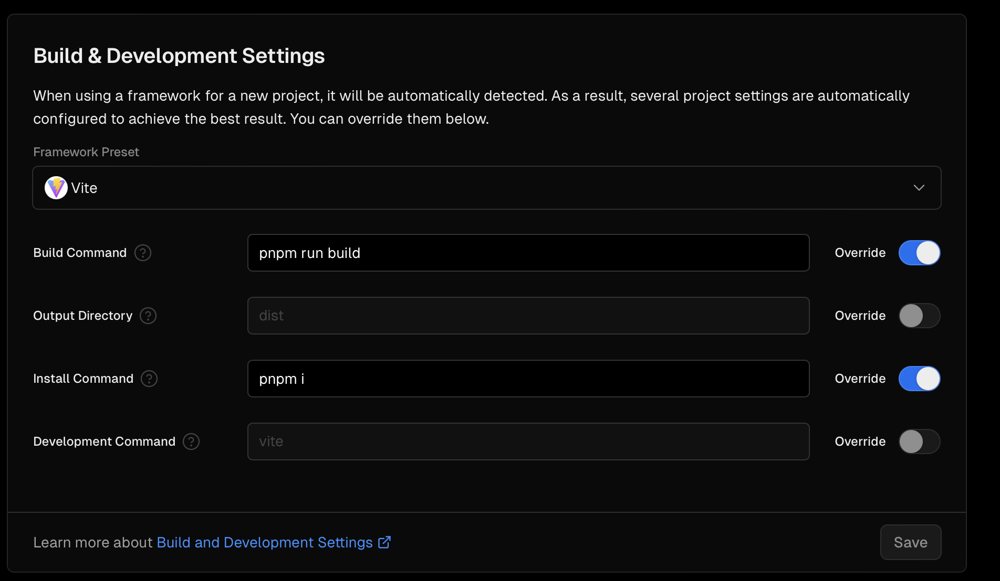

# Telegram Mini App

## Deployed

- prod: https://t.me/drophunt_dev_bot/drophunt_app
- local: https://t.me/drophunt_dev_bot/drophunt

## Setup

Install [mkcert](https://github.com/FiloSottile/mkcert).

```
brew install mkcert
```

Get certificates:

```
mkcert --install
mkcert tma.internal
```

Move them for use:

```
mkdir certificates
mv tma.internal-key.pem certificates
mv tma.internal.pem certificates
```

Edit `/etc/hosts`:

```
sudo nvim /etc/hosts
```

Then add `127.0.0.1       tma.internal` line at the end and save (`:wq`).

Create Telegram mini app with [BotFather](https://telegram.me/BotFather).

```
/newapp
```

Then follow instructions.

Install dependencies:

```
pnpm i
```

Copy the URL: `https://tma.internal:5173/` and give it to BotFather.

Start the mini app and changes will reflect in the mini app.

## Deploy

Comment out these lines in [vite.config.ts](vite.config.ts):

```
https: {
  cert: readFileSync(resolve("certificates/tma.internal.pem")),
  key: readFileSync(resolve("certificates/tma.internal-key.pem")),
},
```

Uncomment these lines:

```
// basicSsl({
// 	certDir: resolve("certificates"),
// 	domains: ["tma.internal"],
// }),
```

Then connect to Vercel or somewhere else using these build settings:



## Drophunt Dashboard

Mini app serves to list airdrops + interact with them. To edit airdrops shown and other things, there is [Drophunt Dashboard repo](https://github.com/nikitavoloboev/drophunt-dashboard).

## Note

Built from [Telegram Mini Apps React template](https://github.com/Telegram-Mini-Apps/reactjs-template).
